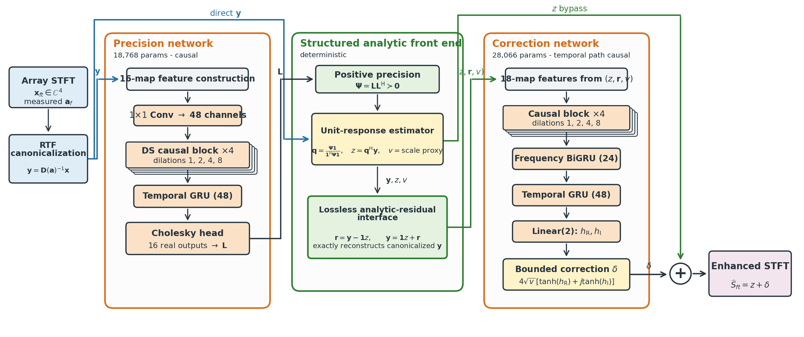

# SARC: Structured Analytic-Residual Correction

This repository contains the PyTorch implementation and frozen checkpoints for
**Structured Analytic-Residual Correction (SARC)**, a lightweight calibrated
four-microphone speech-enhancement method.

SARC first divides out a measured frontal relative transfer function (RTF), so
the modeled target is common across microphones. A precision network produces a
Hermitian positive-definite matrix and an analytic unit-response estimate `z`.
The deterministic residual `r = y - 1z` keeps the array information omitted by
scalar estimation, because `y = 1z + r`. A second network uses `(z, r, v)` to
predict a bounded complex correction, and the enhanced STFT is `z + delta`.



## Main result

On the frozen four-microphone Shokz evaluation set, SARC achieves
**17.527 +/- 0.053 dB SI-SDR improvement**, **0.961 +/- 0.001 STOI**, and
**2.730 +/- 0.057 PESQ** over three runs. The complete model has 46,834
parameters. Machine-readable tables are available in [`results/`](results/).

## Installation

```bash
git clone https://github.com/jgr2021/SARC.git
cd SARC
python -m venv .venv
# Windows: .venv\Scripts\activate
# Linux/macOS: source .venv/bin/activate
pip install -e .
```

## Inference

Input must be a synchronized four-channel, 16-kHz WAV file in the same channel
order as the released model.

```bash
python scripts/infer.py input_4ch.wav enhanced.wav \
  --checkpoint checkpoints/sarc_seed1.pt
```

The measured RTF is stored in the checkpoint. The command writes a mono
floating-point WAV file.

## Verification

```bash
python -m unittest discover -s tests -v
python scripts/inspect_checkpoint.py checkpoints/sarc_seed1.pt
```

The tests check the 46,834-parameter count, unit-response constraint, and the
lossless identity between the canonicalized observation and `(z, r)`.

## Repository structure

```text
SARC/
|-- sarc/          model, STFT, and checkpoint loading
|-- scripts/       training, inference, and checkpoint inspection
|-- checkpoints/   three frozen SARC runs
|-- results/       paper tables in CSV form
|-- docs/          data and reproducibility notes
|-- paper/         architecture figure
`-- tests/         structural tests
```

## Data availability

The private Shokz recordings are not redistributed. See [`docs/DATA.md`](docs/DATA.md)
for the required input format and calibration assumptions.

For retraining, place fixed-length `.npz` examples in one directory. Each file
must contain float32 arrays `mixture` with shape `[4, samples]` and `target` with
shape `[samples]`, together with a complex `[257, 4]` RTF saved as `.npy`:

```bash
python scripts/train.py --train data/train --rtf data/target_rtf.npy \
  --output outputs/sarc.pt
```

## Citation

The bibliographic entry will be added after acceptance. Until then, please cite
the repository and the accompanying manuscript.
