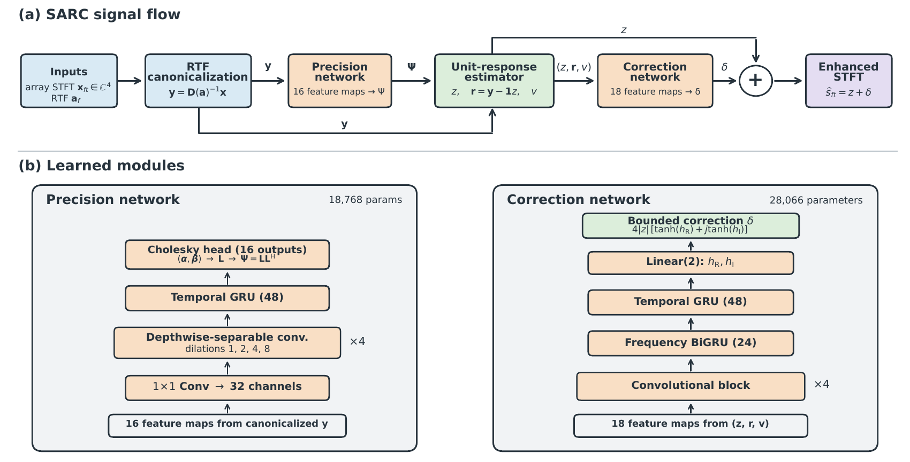

# SARC: Structured Analytic-Residual Correction

This repository contains the PyTorch implementation and frozen checkpoints for
**Structured Analytic-Residual Correction (SARC)**, a lightweight calibrated
four-microphone speech-enhancement method.

**Authors:** Gurui Jin, Xiao-Ping Zhang, Le Xiao, Yue Wang, and Zhenyu Liu.
This is a research manuscript and code release; no publication or acceptance is claimed.

## Background and problem

Spatial filtering can preserve a calibrated target response while leaving
residual interference. A neural post-filter receiving only its single-channel
output cannot directly examine inter-channel differences. SARC provides
spatial residuals that cancel the modeled target as references for correction.

For one time-frequency bin, the calibrated observation model is

$$x_m=a_m s+n_m, \qquad y_m=x_m/a_m=s+\eta_m.$$

Here $a_m$ is the target RTF, $s$ is the reference-channel target, and $n_m$
is interference. Alignment makes the modeled target common across microphones,
not their interference. The input is synchronized four-channel speech at
16 kHz with a matching fixed target calibration; the output is enhanced mono speech.

## Proposed method

SARC first divides out a fixed frontal relative transfer function (RTF), so
the modeled target is common across microphones. A precision network produces a
Hermitian positive-definite matrix and an analytic unit-response estimate `z`.
The spatial residual `r = y - 1z` exposes channel-to-channel nuisance differences
to guide correction of interference remaining in `z`. A second network uses `(z, r, v)` to
predict a bounded complex correction, and the enhanced STFT is `z + delta`.

The target-preserving constraint applies to the analytic estimate, not a
guarantee that the final neural output is distortion-free. Calibration mismatch
can leave target leakage in the residuals.



## Main result

On the fixed four-microphone evaluation set, SARC achieves
**17.527 +/- 0.053 dB SI-SDR improvement**, **0.961 +/- 0.001 STOI**, and
**2.730 +/- 0.057 PESQ** over three runs. The complete model has 46,834
parameters. Machine-readable tables are available in [`results/`](results/).

## Architecture and runtime

| Module | Dimensions | Parameters |
| --- | --- | ---: |
| Precision network | 16 features; convolution width **32**; temporal GRU hidden size **48**; 16-output Cholesky head | 18,768 |
| Correction network | 18 features; convolution width **32**; frequency BiGRU **24 per direction**; temporal GRU **48**; 2-output linear head | 28,066 |
| Total | Four-channel model | **46,834** |

Both networks use four convolutional blocks with temporal dilations 1, 2, 4, 8.
The bidirectional GRU operates along frequency, not future time frames. Its
48-dimensional output is projected to 32 channels and added to its input before
the temporal GRU. See [architecture details](docs/ARCHITECTURE.md).
The released correction is scaled by `4 * max(abs(z), 1e-8)`, not `sqrt(v)`.

Table 1 includes CPU and GPU full-utterance runtimes; see
[`docs/RUNTIME.md`](docs/RUNTIME.md) for the protocol and limitations.
These are implementation timings, not proof of real-time streaming deployment.

## Installation

Use Python 3.10 or later. The original experiments used PyTorch 2.5.1.

```bash
git clone https://github.com/jgr2021/SARC.git
cd SARC
python -m venv .venv
# Windows: .venv\Scripts\activate
# Linux/macOS: source .venv/bin/activate
pip install -e .
```

## Inference

Input must be a synchronized four-channel, 16-kHz WAV file in the same channel
order as the released model.

```bash
python scripts/infer.py input_4ch.wav enhanced.wav \
  --checkpoint checkpoints/sarc_seed1.pt
```

The fixed RTF is stored in the checkpoint. The command writes a mono
floating-point WAV file.

This script processes whole files; it is not a stateful streaming implementation.
For a different array or acoustic calibration, obtain a matching target RTF and
retrain instead of assuming that the frozen model transfers.

## Verification

```bash
python -m unittest discover -s tests -v
python scripts/inspect_checkpoint.py checkpoints/sarc_seed1.pt
```

Tests check architecture dimensions, parameter counts, released checkpoint
hashes and loading, finite inference, analytic constraints, and training
regression values. They do not replace a full benchmark or from-scratch retraining.

## Repository structure

```text
SARC/
|-- sarc/          model, STFT, and checkpoint loading
|-- scripts/       training, inference, and checkpoint inspection
|-- checkpoints/   three frozen SARC runs
|-- results/       paper tables in CSV form
|-- docs/          data and reproducibility notes
|-- paper/         architecture figure
`-- tests/         structural tests
```

## Data availability

The evaluation mixtures combine public LibriSpeech speech and ESC-50 sounds
with confidential spatial transfer assets; they are not a public-only synthetic
dataset and the final audio is not distributed. See [`docs/DATA.md`](docs/DATA.md)
for source links, training/evaluation construction, and reproducibility limits.
The [80-trial public-source manifest](data/manifests/evaluation_public_sources.csv)
is available without restricted spatial assets or internal identifiers.

For retraining, place fixed-length `.npz` examples in one directory. Each file
must contain float32 arrays `mixture` with shape `[4, samples]` and `target` with
shape `[samples]`, together with a complex `[257, 4]` RTF saved as `.npy`:

```bash
python scripts/train.py --train data/train --rtf data/target_rtf.npy \
  --validation data/validation --seed-index 1 --output outputs/sarc.pt
```

The training recipe follows the successful Table 1 experiments, including
stage-specific seeds, batch sizes (3, 4, 3), numerical floors, and selection
of the best validation checkpoint at each stage. See
[`docs/REPRODUCIBILITY.md`](docs/REPRODUCIBILITY.md) for the original online-batch
interface and the limits of retraining from pre-rendered NPZ pairs.

## Citation

If you use SARC in your research, please cite:

> G. Jin, X.-P. Zhang, L. Xiao, Y. Wang, and Z. Liu, “SARC: Structured Analytic-Residual Correction for Lightweight Multichannel Speech Enhancement,” research manuscript, 2026.

```bibtex
@unpublished{jin2026sarc,
  author = {Jin, Gurui and Zhang, Xiao-Ping and Xiao, Le and Wang, Yue and Liu, Zhenyu},
  title = {{SARC}: Structured Analytic-Residual Correction for Lightweight Multichannel Speech Enhancement},
  year = {2026},
  note = {Research manuscript},
  url = {https://github.com/jgr2021/SARC}
}
```

